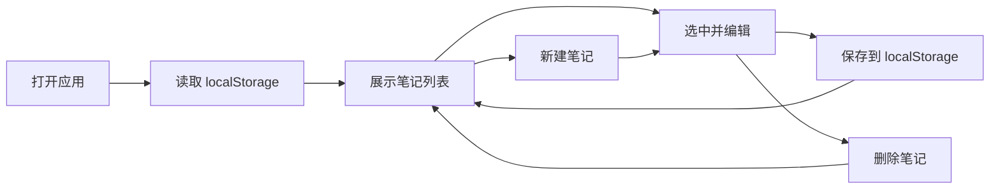

# 在线笔记应用需求（MVP）

实现一个纯前端的**在线笔记应用**（React 18 + Vite）。页面主组件命名为 **NoteApp**。  
数据全部保存在浏览器 **localStorage**，**不调用后端 API**，不需要 MSW Mock（可不生成 `handlers.js` 或留空实现）。

**本期目标：** 单次生成即可 `npm run dev` 打开，用户能明显感知「这是一个在线笔记应用」——有笔记列表、能新建/编辑/保存/删除、能搜索、刷新后数据仍在。

---

## 产品定位（用户可感知）

- 应用名称展示：**在线笔记**
- 布局：**左侧笔记列表 + 右侧编辑区**（两栏即可，不必三栏）
- 风格：简洁清爽；主色建议绿色 `#10b981` 用于标题或按钮（普通 CSS 实现，**不要**引入 Tailwind）

---

## 功能范围（本期必须实现）

### 1. 初始化与持久化

- 使用 `localStorage`，键名：`notes-app-mvp`
- 存储结构示例：

```json
{
  "notes": [
    {
      "id": "1",
      "title": "欢迎使用",
      "content": "这是你的第一条笔记，可以点击保存修改内容。",
      "updatedAt": "2026-05-25T10:00:00.000Z"
    }
  ]
}
```

- 首次打开（无数据）时写入一条默认笔记（标题 **欢迎使用**）
- 每次 **保存** 后写回 localStorage；刷新页面后数据不丢失

### 2. 笔记列表（左侧）

- 顶部搜索框，`placeholder` 或 `aria-label`：**搜索笔记**
- 输入关键词时，按 **标题包含** 过滤列表（不要求正文全文检索）
- 列表展示每条笔记的 **标题**；当前选中项高亮
- 列表上方按钮：**新建笔记**（点击后右侧进入新笔记编辑态，标题默认为 **未命名笔记**）

### 3. 编辑区（右侧）

- 未选中任何笔记时显示：**请选择或新建一条笔记**
- 选中或新建后显示：
  - 标题输入框，`aria-label`：**笔记标题**
  - 正文多行输入框，`aria-label`：**笔记内容**
  - 按钮 **保存**、**删除**
- **保存**：将当前标题与正文写入 state 并持久化；顶部可短暂显示 **已保存**（可选）
- **删除**：确认文案含 **确认删除**；确认后从列表移除并更新 localStorage，右侧回到空状态文案

### 4. 明确不做（本期省略，勿生成）

- 富文本 / Markdown / 代码高亮 / 图片
- 多笔记本、标签、收藏、回收站
- 导入导出、主题切换、快捷键设置
- 后端 REST API、`fetch` 请求（避免依赖 MSW）

---

## 组件划分（供设计 / 代码生成）

| 组件 | 职责 |
|------|------|
| **NoteApp** | 主页面：布局、state、localStorage 读写、搜索过滤 |
| **NoteSidebar** | 搜索框、新建按钮、笔记标题列表 |
| **NoteEditor** | 标题/正文编辑、保存、删除、空状态提示 |

可放在 `src/pages/NoteApp.jsx`，子组件放 `src/components/`。

---

## 状态设计（NoteApp）

| 字段 | 类型 | 说明 |
|------|------|------|
| `notes` | `array` | 全部笔记 |
| `filteredNotes` | `array` | 搜索后的列表 |
| `selectedId` | `string \| null` | 当前选中笔记 id |
| `draftTitle` | `string` | 编辑区标题 |
| `draftContent` | `string` | 编辑区正文 |
| `searchQuery` | `string` | 搜索关键词 |
| `saveHint` | `string` | 如 **已保存**（可选） |

---

## 界面固定文案（测试须可断言）

| 文案 | 用途 |
|------|------|
| 在线笔记 | 应用主标题 `<h1>` |
| 搜索笔记 | 搜索框 |
| 新建笔记 | 新建按钮 |
| 请选择或新建一条笔记 | 无选中时的编辑区提示 |
| 笔记标题 | 标题输入 |
| 笔记内容 | 正文输入 |
| 保存 | 保存按钮 |
| 删除 | 删除按钮 |
| 确认删除 | 删除确认 |
| 欢迎使用 | 默认示例笔记标题 |
| 已保存 | 保存成功提示（若实现） |

---

## 简易流程（Mermaid，可选实现参考）



---

## 技术约束（与 UIForge 模板一致）

- React 18 函数组件 + Hooks
- **仅使用** Vite 模板已有依赖（react、react-dom）；样式用 **内联 style 或 `src/App.css` / 新建 `src/notes.css`**
- **禁止** 在 `package.json` 中添加 Tailwind、Tiptap、marked 等未安装依赖
- 入口：`src/App.jsx` 仅渲染 `<NoteApp />`
- 主文件必须为：`src/pages/NoteApp.jsx`

---

## 验收要点

1. `npm run dev` 可打开，首屏有 **在线笔记**
2. 左侧可见至少一条 **欢迎使用**，右侧可编辑并 **保存**
3. **新建笔记** 后列表增加一项，刷新仍在
4. **搜索笔记** 可过滤标题
5. **删除** 有确认，删除后列表减少
6. 全程无 API 请求失败导致的空白页（因不使用远程 API）

---

## 智能体生成说明

- `design_spec.page_component` 必须为字符串 **`NoteApp`**
- `code` 阶段必须生成 **`src/pages/NoteApp.jsx`**，且 `App.jsx` 引用路径一致
- `test` 阶段根据已生成代码产出 **`tests/*.test.jsx`** 与 **`report/test_report.md`**
- 优先保证 **可编译、可渲染、可交互**；功能宁简勿缺，勿一次实现全文档旧版所有模块
