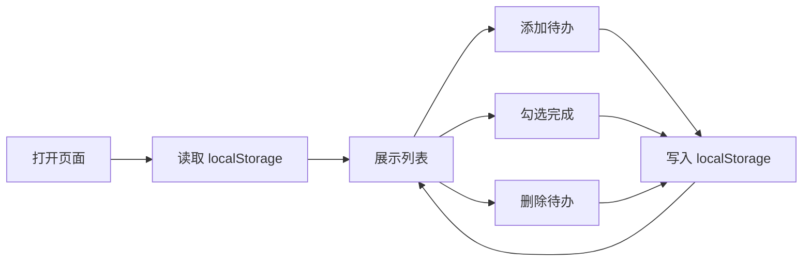

# 待办列表页面需求（MVP）

实现一个纯前端的**待办事项列表**页面（React 18 + Vite）。页面主组件命名为 **TodoPage**。  
数据全部保存在浏览器 **localStorage**，**不调用后端 API**，不需要 MSW Mock（可不生成 `handlers.js` 或留空实现）。

**本期目标：** 单次生成即可 `npm run dev` 打开，用户能明显感知「这是一个待办列表」——能添加、勾选完成、删除、刷新后数据仍在。  
**产品原则：** 非空标题点击 **添加** 后，待办 **必定进入列表**（无「添加失败」）；可对任意待办 **删除**（含确认）。

---

## 产品定位（用户可感知）

- 页面主标题（`<h1>`）：**我的待办**
- 上方：**待办标题** 输入框 + **添加** 按钮
- 下方：待办列表（标题 + 是否完成 + **删除**）
- 风格简洁；主色可用蓝色或绿色点缀按钮（普通 CSS，**不要** Tailwind）

---

## 功能范围（本期必须实现）

### 1. 初始化与持久化

- `localStorage` 键名：`todos-app-mvp`
- 存储结构示例：

```json
{
  "todos": [
    {
      "id": "1",
      "title": "学习 UIForge",
      "completed": false
    }
  ]
}
```

- 首次打开（无数据）时写入一条默认待办，标题为 **学习 UIForge**
- 任意增删改后写回 `localStorage`；刷新页面数据仍在

### 2. 加载与列表展示

- 进入页面即从 `localStorage` 读取并展示列表（无需 **加载中...**，本地读取即可）
- 若无待办：列表区域显示 **暂无待办，添加一条吧**
- 若有待办：每条展示 **标题**、**完成状态**（勾选框，已完成为选中）
- 列表上方可选搜索框，`placeholder` 或 `aria-label`：**搜索待办**；按标题 **包含** 关键词过滤（可不实现搜索，但推荐保留以体现「列表应用」）

### 3. 新增待办

**控件：**

- 输入框：`aria-label` 或 `placeholder` 至少其一为 **待办标题**
- 按钮：**添加**

**规则：**

- 空标题或仅空白：不新增，提示 **请输入待办标题**（可见即可）
- 非空标题点击 **添加**：
  - 生成新 `id`，`completed: false`
  - 追加到列表并持久化
  - **清空** 输入框
  - 新项 **立即出现在列表中**
  - 可选短暂提示 **添加成功**（文案须为 **添加成功**）
- **不实现**「添加失败」分支或相关文案

### 4. 切换完成状态

- 点击勾选框切换该项 `completed` true/false
- 立即更新界面并写回 `localStorage`
- 已完成项标题可使用删除线或变灰（可选，须能一眼区分）

### 5. 删除待办

- 每条有 **删除** 按钮
- 点击后确认，文案含 **确认删除** 或 **确定删除该待办？**
- **确认**：从列表移除并持久化
- **取消**：关闭确认，不删除

### 6. 明确不做（本期省略）

- 后端 REST、`fetch`、`/api/todos`
- 添加失败、网络错误条（无远程请求）
- 子任务、截止日期、拖拽排序、用户登录
- 富文本、多列表/分类

---

## 组件划分（供设计 / 代码生成）

| 组件 | 职责 |
|------|------|
| **TodoPage** | 主页面：state、localStorage、列表过滤、删除确认 |
| **AddTodoForm** | **待办标题** 输入 + **添加**、空标题校验 |
| **TodoList** | 空状态 / 列表渲染 |
| **TodoItem** | 勾选、标题展示、**删除** |

主文件：`src/pages/TodoPage.jsx`，子组件可放 `src/components/`。

---

## 状态设计（TodoPage）

| 字段 | 类型 | 说明 |
|------|------|------|
| `todos` | `array` | 全部待办 |
| `filteredTodos` | `array` | 搜索过滤结果（若实现搜索） |
| `inputTitle` | `string` | 输入框内容 |
| `searchQuery` | `string` | 搜索关键词（可选） |
| `deleteTargetId` | `string \| null` | 待删除项 id |
| `showDeleteConfirm` | `boolean` | 是否显示删除确认 |
| `hint` | `string` | 如 **添加成功**、**请输入待办标题** |

---

## 界面固定文案（测试须可断言）

| 文案 | 用途 |
|------|------|
| 我的待办 | 主标题 `<h1>` |
| 待办标题 | 输入框 |
| 添加 | 添加按钮 |
| 请输入待办标题 | 空标题提示 |
| 添加成功 | 添加成功提示（若实现） |
| 暂无待办，添加一条吧 | 空列表 |
| 搜索待办 | 搜索框（若实现） |
| 删除 | 删除按钮 |
| 确认删除 | 删除确认 |
| 学习 UIForge | 默认示例待办标题 |

---

## 简易流程（Mermaid，可选）



---

## 技术约束（与 UIForge 模板一致）

- React 18 函数组件 + Hooks
- **仅使用** 模板已有依赖（react、react-dom）；样式用内联 style 或 `src/App.css` / `src/todos.css`
- **禁止** 添加 Tailwind 等未在 `package.json` 中的依赖
- `src/App.jsx` 仅渲染 `<TodoPage />`
- 必须生成 **`src/pages/TodoPage.jsx`**，且与 `design_spec.page_component` 一致

---

## 验收要点

1. `npm run dev` 可打开，首屏有 **我的待办**
2. 可见默认待办 **学习 UIForge**（或添加后可见）
3. 输入非空标题点 **添加**：输入框清空，列表出现新标题
4. 空标题点 **添加**：提示 **请输入待办标题**，列表不变
5. 页面中 **不出现** **添加失败**
6. 可勾选切换完成状态，可 **删除**（有确认），刷新后仍正确
7. 无因 API 失败导致的白屏（不使用远程 API）

---

## 智能体生成说明

- `design_spec.page_component` 必须为字符串 **`TodoPage`**
- `code` 阶段必须生成 **`src/pages/TodoPage.jsx`**
- 优先 **可编译、可渲染、可交互**；宁简勿滥，勿引入未声明依赖
